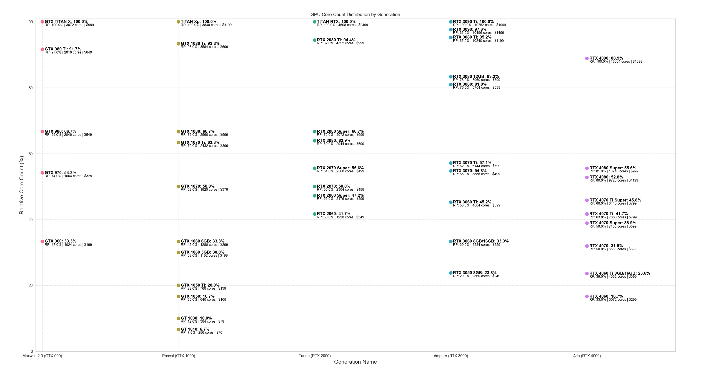
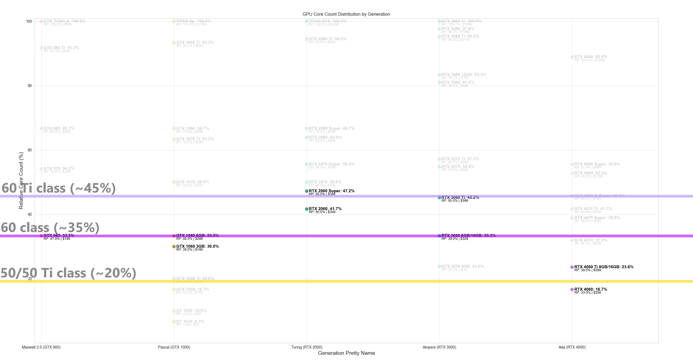
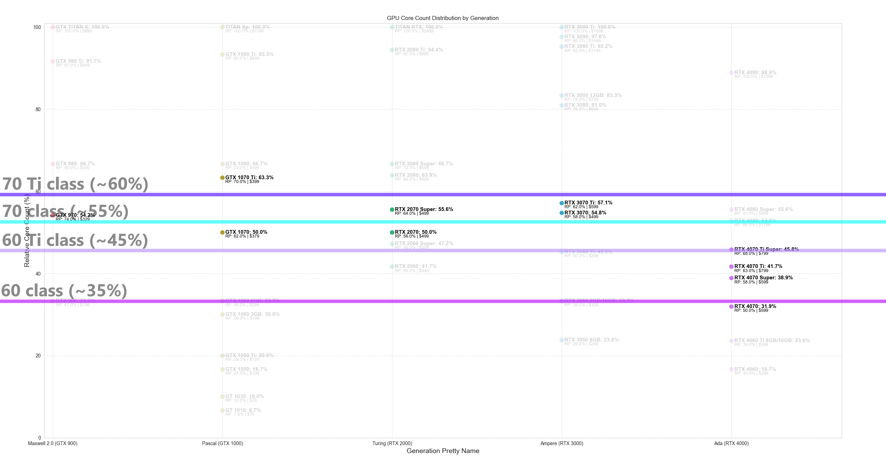
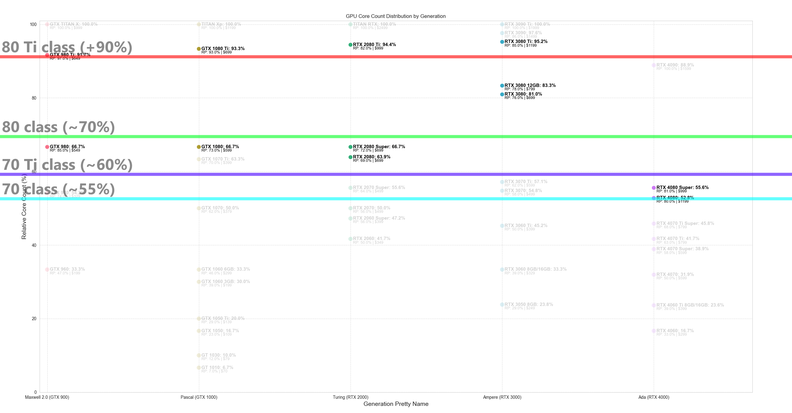
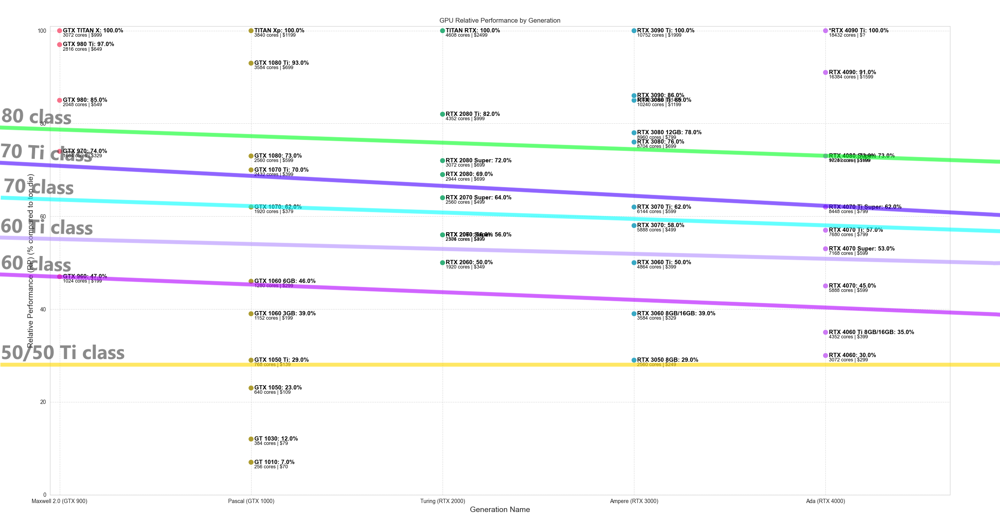

# Historical analysis of NVIDIA GPUs relative performance, core count and die sizes across product classes and generations

Hi! With how divisive the pricing and value is for the RTX 40 series (Ada), I've collected and organized data (from TechPowerUp) for the previous 5 generations, that is, starting from Maxwell 2.0 (RTX 9xx) up until Ada (RTX 4xxx), and would like to share some findings and trivia about why I feel this current generation delivers bad value overall. NOTE: I'm talking about gaming performance on these conclusions and analysis, not productivity or AI workloads.

In this generation we got some high highs and stupid low lows. We had technically good products, but at high prices (talking about RTX 4090), while others, well... let's just say not so good products for gaming like the 4060 Ti 16Gb. 

I wanted to quantify how much of a good or bad value we get this generation compared to what we had the previous generations. This was also fueled by the downright shameful attempt to release a 12Gb 4080 which turned into the 4070 Ti, and I'll show you WHY I call this "unlaunch" shameful.

## Methodology
I've scraped the TechPowerUp GPU database for some general information for all mainstream gaming GPUs from Maxwell 2.0 up until Ada. Stuff like release dates, memory, MSRP, core count, relative performance and other data. 

The idea is to compare each class of GPU on a given generation with the "*top tier*" die available for that generation. For instance, the regular 3080 GPU is built using the GA102 die, and while the 3080 has 8704 CUDA cores, the GA102 die, when fully enabled, has 10752 cores and is the best die available for Ampere for gaming. This means that the regular 3080 is, of course, cut down, offering 8704/10752 = 80% of the total possible cores for that generation.

With that information, we can get an idea of how much value (as in, CUDA cores) we as consumers get relative to what is POSSIBLE on that generation. We can see what we previously got in past generations and compare it with the current generation. As we'll see further into this post, there is some weird shenanigans going on with Ada.
This analysis totally DISCONSIDERS architectural gains, node size complexities, even video memory or other improvements. **It is purely a metric of how much of a fully enabled die we are getting for the xx50, xx60, xx70, xx80 and xx90 class GPUs, again, comparing the number of cores we get versus what is possible on a given generation.**

In this post, when talking about "cut down ratio" or similar terms, think of 50% being a card having 50% of the CUDA cores of the most advanced, top tier die available that generation. However I also mention a metric called RP, or relative performance. A RP of 50% means that that card performs half as well as the top tier card (source is TechPowerUp's relative performance database). This denomination is needed because again, the number of CUDA cores does not relate 1:1 with performance. For instance Some cards have 33% of the cores but perform at 45+% compared to their top tier counterpart.

## The full picture

In the following image I've plotted the relevant data for this analysis. The X-axis divides each GPU generation, starting with Maxwell 2.0 up until Ada. The Y-axis shows how many cores the represented GPU has compared to the "top tier" die for that generation. For instance, in Pascal (GTX 10 series), the TITAN Xp is the fully enabled top die, the GP102, with 3840 CUDA cores. The 1060 6Gb, built on GP106, has 1280 CUDA cores, which is exactly 33.3% as many cores as the TITAN Xp.

I've also included, below the card name and die percentage compared to top die, other relevant information such as the relative performance (RP) each card has compared to the top tier card, actual number of cores and MSRP at launch. **This allows us to see that even though the 1060 6Gb only has 33.3% of the cores of the TITAN Xp, it performs 46% as well as it (noted on the chart as RP: 46%), thus, CUDA core count is not perfectly correlated with actual performance (as we all know there are other factors at play like clock speed, memory, heat, etc.).**

Here is the complete dataset:

## Some conclusions we make from this chart alone

1. The Ada generation is the only generation that DID NOT release the fully enabled die on consumer gaming GPUs. The 4090 is built on a cut down AD102 chip such that it only has 88.9% of the possible CUDA cores. **This left room for a TITAN Ada or 4090 Ti which never released.**
2. The 4090, being ~89% of the full die (of the unreleased 4090 Ti), is actually BELOW the "cut down ratio" for the previous 4 generations xx80 Ti cards. The 980 Ti was 91.7% of the full die. The 1080 Ti was 93.3% of the full Pascal die. The 2080 Ti was 94.4% of the full Turing die. The 3080 Ti was 95.2% of the full Ampere die. **Thus, if we use the "cut down level" as a naming parameter, the 4090 should've been called a 4080 Ti and even then it'd be below what we have been getting the previous 4 generations.**

3. In the Ampere generation, the xx80 class GPUs were an anomaly regarding their core counts. In Maxwell 2.0, the 980 was 66.7% of the full die used in the TITAN X. The 1080 was also 66.7% of the full die for Pascal. The 2080 and 2080 Super were ~64% and again, exactly 66.7% of their full die respectively. As you can see, historically, the xx80 class GPU was always 2/3 of the full die. Then in Ampere we actually got a 3080 which was 81% of the full die. Fast forward to today and the 4080 Super is only at 55.6% of the full Ada die. **This means that we went from usually getting 66% of the die for 80-class GPUs (Maxwell 2.0, Pascal, Turing), then getting 80% in Ampere, to now getting just 55% for Ada.** If we check closely for the actual perceived performance (the relative performance (RP)) metric, while the 3080 reached a RP of 76% of the 3090 Ti (which is the full die), the 4080 Super reaches 81% of the performance of a 4090, which looks good, right? WRONG! While yes, the 4080 Super reaches 81% of the performance of a 4090, **remember that the 4090 is an already cut down version of the full AD102 die.** If we speculate that the 4090 Ti would've had 10% more performance than the 4090, then the 4090's RP would be ~91%, and **the 4080 Super would be at ~73% of the performance of the top die**. This is in line with the RP for the 80-class GPUs for the Pascal, Turing and Ampere generations, which had their 80-class GPUs at 73%, 72% and 76% RP for their top dies. **This means that the performance for the 4080 is in line with past performance for that class in previous generations, despite being more cut down in core count.** This doesn't excuse the absurd pricing, specially for the original 4080 and specially considering we are getting less cores for the price, as noted by it being cut down at 55%. This also doesn't excuse the lame 4080 12Gb, which was later released as 4070 Ti, which has a RP of 63% compared to the 4090 (but remember, we cannot compare RP with the 4090), so again, if the 4090 Ti was 10% faster than 4090, the unlaunched 4080 12Gb would have a RP of 57%, way below the standard RP = ~73%ish we usually get.
4. **The 4060 sucks.** It has 16.7% of the cores of a the full AD102 die and has a RP of 33% of the 4090 (which again is already cut down). **It is as cut down as a 1050 was in the Pascal generation, thus it should've been called a 4050, two classes below what it is (!!!)**. It also costs \$299 USD! If we again assume a full die 4090 Ti 10% faster than a 4090, the 4060 would've been at RP = 29.9%, in line with the RP of a 3050 8Gb or a 1050 Ti. This means that for the \$300 it costs, it is more cut down and performs worse than any other 60-class GPU in their own generation. Just for comparison, the 1060 has 30% of the cores of its top die, almost double of what the 4060 has, and also it performs overall at almost half of what a TITAN Xp did (RP 46%), while the 4060 doesn't reach one third of a theoretical Ada TITAN/4090 Ti (RP 30%).

There are many other conclusions and points you can make yourself. Remember that this analysis does NOT take into account memory, heat, etc. and other features like DLSS or path tracing performance, because those are either gimmicks or eye candy at the moment for most consumers, as not everyone can afford a 4090 and people game in third world countries with 100% import tax as well (sad noises).

The point I'm trying to make is that the Ada cards are more cut down than ever, and while some retain their performance targets (like the 80-class targeting ~75% of the top die's performance, which the 4080 Super does), others seem to just plain suck. There is an argument for value, extra features, inflation and all that, but we, as consumers, factually never paid more for such a cut down amount of cores compared to what is possible in the current generation. 

In previous times, like in Pascal, 16% of the top die cost us \$109, in the form of the 1050 Ti. Nowadays the same 16% of the top die costs \$299 as the 4060. However, $109 in Oct 2016 (when the 1050 Ti launched) is now, adjusted for inflation, \$140. Not \$299. Call it bad yields, greed or something else, because it isn't JUST inflation.

## Some extra charts to facilitate visualization

These highlight the increases and decreases in core counts relative to the top die for the 60-class, 70-class and 80-class cards across the generations. The Y-axis again represents the percentage of cores in a card compared to the top tier chip.

**xx60 and xx60 Ti class:**
Here we see a large decrease in the number of possible cores we get in the Ada generation. The 4060 Ti is as cut down compared to full AD102 than a 3050 8Gb is to full GA102. This is two tiers below!

**xx70 and xx70 Ti class:**
Again, more cuts! The 4070 Ti Super is MORE CUT DOWN compared to full AD102 than a 1070 is to GP102. Again, two tiers down AND a "Super-refresh" later. The regular 4070 is MORE cut down than a 1060 6Gb was. All 70-class cards of the Ada series are at or below historical xx60 Ti levels.

**xx80 and xx80 Ti class:**
This is all over the place. Notice the large limbo between Ampere and Ada. The 4080 Super is as cut down as the 3070 Ti. Even if we disregard the increase in core counts for Ampere, the 4080 and 4080 Super are both at the 70-class levels of core counts.

If any of these charts and the core ratio are to be taken as the naming convention, then:
- 4060 is actually a 4050 (two tiers down);
- 4060 Ti is actually a 4050 Ti (two tiers down);
- 4070 should be the 4060 (two tiers down);
- 4070 Super is between a 60 and 60 Ti class;
- 4070 Ti is also between a 60 and 60 Ti class;
- 4070 Ti Super is actually a 4060 Ti (two tiers and a Super-refresh down, but has 16Gb VRAM);
- regular 4080 should be the 4070 (two tiers down);
- 4080 Super could be a 4070 Ti (one tier and a Super-refresh down);
- There is no 4080 this generation;
- 4090 is renamed to 4080 Ti;
- There is no 4090 or 4090 Ti tier card this generation.

Again this disregards stuff like the 4070 Ti Super having 16Gb of VRAM, which is good! DLSS, and other stuff are also out of the analysis. However, I won't even start with pricing, I leave that to you to discuss in the comments lol. Please share your thoughts!

## What if we change the metric to be the Relative Performance instead of core count?
Well then, I know some of you would've been interested in seeing this chart. I've changed the Y-axis to instead of showing of much in % of cores a card has versus the top card, now it is the relative performance as TechPowerUp shows. This means that the 1060 6Gb being at 39% means it has 39% of the real world actual performance of a TITAN Xp, the top card for Pascal.

*Note that I included a 4090 Ti for Ada, considering it would have been 10% faster than the current 4090. It is marked with an asterisk in the chart.*

Here it is:

As you can see, it is all over the place, with stuff like the 3090 being close to the 3080 Ti in terms of real world performance, and something like the 2080 Ti being relatively worse than a 1080 Ti was, that is, the 1080 Ti is 93% of a TITAN Xp, but the 2080 Ti is just 82% of a the TITAN RTX. I've not even put a guide line for the 80 Ti class because it's a bit all over the place. However:

- As you can see, the 4080 and 4080 Super both perform at 73% of the theoretical top card for Ada, and looks like the 1080, 2080 Super and 3080 are also all in this 72-76% range, so the expected performance for an 80-class GPU seems to be always near the 75% mark (disregarding the GTX 980 outlier). This could also be the reason they didn't add a meaningful amount of more cores to the 4080 Super compared to the regular 4080, to keep it in line with the 75% performance goal.

- The 70 and 60 class for Ada, however, seem to be struggling. The 4070 Ti Super is at the performance level of a 1070, 2070 Super or 3070 Ti, at around 62% to 64%. It takes the Ti and Super suffixes to get close to what the regular 1070 did in terms of relative performance. Also notice that the suffixes increased every generation. To get ~62% performance we have "1070" > "**Super** 2070" > "**Ti** 3070" > "**Ti** **Super** 4070" > "**Ti** **Super** **Uber** 5070"??? 
  
- The 4070 Ti performs like the regular 2070/2060 Super and 3070 did in their generations.
  
- The 4070 Super is a bit above the 3060 Ti levels. The regular 4070 is below what a 3060 Ti did, as is on par with the 1060 6Gb (which was maybe the greatest bang for buck card of all time? Will the reglar 4070 live for as long as the 1060 did?)
  
- I don't even want to talk about the 4060 Ti and 4060, but okay. The 4060 Ti performs worse than a regular 3060 did in its generation. The regular 4060 is at 3050/1050Ti levels of performance. 

- Performance seems to be trending down overall, although sligthly and I've been very liberal in the placement of the guide lines in the charts.

In short: if you disregard pricing, the 4080/4080 Super are reasonable performers. The 4070, 4070 Ti and their Super refreshes are all one or two tiers above what they should've been (both in core count and raw performance). The 4060 should've been 4050 in terms of performance and core count. The 4060 Ti should've been a 4050 Ti at most, both also being two tiers down what they currently are.

**So what?** We're paying more that we've ever did, even accounting for inflation, for products that are one to two tiers above what they should've been in the first place. Literally paying more for less, in both metrics: core counts relative to the best die and relative performance, the former more than the latter. This is backed by over 4 generations of past cards.

## What we can derive from this
We have noticed some standards NVIDIA seems to go by (not quite set in stone), but for instance, looks like they target ~75% of the performance of the top tier card for the 80-class in any given generation. This means that once we get numbers for the 5090/5090Ti and their die and core counts, we can speculate the performance of the 5080 card. We could extrapolate that for the other cards as well, seeing as the 70-class targets at most 65% of the top card. Let's hope we get more of a Pascal type of generation for Blackwell.

Expect me to update these charts once Blackwell releases.

## Sources
I invite you to check the [repository](https://github.com/BeautyFades/NVIDIA-GPU-die-size) with the database and code for the visualizations. Keep in mind this was hacked together in about an hour so the code is super simple and ugly.
Thanks TechPowerUp for the [data](https://www.techpowerup.com/gpu-specs/).

That is all, sorry for any mistakes, I'm not a native English speaker.